# Project Explainer (Interview Version)
### Reinforcement Learning Based Educational Game for Personalized Learning (Endless Worlds)

## 1. The Problem (in one line)
Most educational apps give every student the **same difficulty** and the **same fixed set of questions** — so it's either too easy/too hard, and the questions run out and get memorized instead of learned.

## 2. What the project does (one line)
A 2D exploration game (Godot) where difficulty auto-adjusts using reinforcement learning, and every question is freshly generated by an LLM from real web content — instead of a fixed question bank.

## 3. Functional Components

**Godot game client (frontend)**
- **World generation** (`map_components/`)
  - 2D island generated from layered simplex noise, with a radial falloff so it always stays one connected landmass (no disconnected islands).
  - Day-night cycle and weather run on timers and affect ambience/lighting, not gameplay difficulty.
  - Spawns interactable objects — wells (where questions are answered) and hint pickups — at valid world positions.
- **Player controller** (`player/`)
  - Movement, animation state machine, and camera shake/follow.
  - Talks to the world/map system for collisions and interactables, not directly to the AI or backend.
- **Home screen** (`ui/`)
  - Topic selection before a run starts.
  - Tutorial, stats screen, and the Learning Journal viewer (history of past questions).
- **Hint system**
  - Hints are placed as physical pickups in the world rather than a simple "click for hint" button, so getting help costs exploration time.
  - Collecting a hint pickup unlocks one hint tied to the current question; using a hint is what flips the RL outcome from "Boring" to "Challenged" even on a correct answer.
- **Answer popups** (`ui/answerpopups/answer_popup.gd`)
  - Multiple question modes: MCQ, Wordle-style guessing, KBC-style (lock-in answer + lifelines + suspense reveal), and others.
  - Each mode has its own answer-validation logic, which is why this script is the largest/most complex one in the client (flagged as a refactor candidate — see limitations).
- **AI Question Generator (client)** (`ai/ai_question_generator.gd`)
  - Calls `/api/scrape` then `/api/generate_riddle` in sequence, and shows a loading state to the player while waiting.
  - Falls back to a small local riddle bank if either backend call fails or times out, so a network issue degrades the game instead of breaking it.
- **Difficulty RL module** (`ai/` — `DifficultyRL`)
  - Runs the Q-learning logic entirely client-side (no backend round-trip needed for a difficulty decision).
  - Persists its learned Q-table to a local save file (`user://difficulty_rl.json`) so learning carries over between play sessions.
- **Global state manager** (`core/global.gd`)
  - Single autoloaded source of truth for score, lifetime stats, the current save file, and the Learning Journal — shared across every scene so the game doesn't need to pass state manually between screens.
  - Loads the save and the RL state on startup (`_ready()`), and writes updates via `save_game()` and `end_game(win)`.

**Python backend (FastAPI)**
- `/api/scrape`
  - Takes a topic, runs a DuckDuckGo web search, concurrently fetches a handful of candidate pages (each with its own timeout), and keeps the first page whose cleaned text is long enough to be useful.
  - Resets the vector index before storing, so a new topic never mixes with leftover chunks from a previous one.
- **Chunk + embed + store** (`services/vectordb.py`)
  - Splits the cleaned page text into overlapping chunks (so no idea gets cut awkwardly in half).
  - Embeds each chunk into a vector using a sentence-transformer model (MiniLM) and stores them in a FAISS index for fast nearest-neighbour lookup.
- `/api/generate_riddle` (`services/llm.py`)
  - Retrieves the chunks closest to the topic, trims them to fit a prompt budget, and sends them to the LLM (Groq) with a strict instruction: return only a fixed JSON shape — question, exactly 4 options, one correct answer, hints, and a tag saying whether it was actually grounded in retrieved text.
- `/api/evaluate_code`
  - For coding-type riddles, the player's submitted code plus the original question are sent to the LLM, which judges correctness and returns pass/fail with feedback text — this is the "code is compiled/checked via LLM" part, not a separate execution sandbox.
- `/api/rag`
  - A general-purpose retrieve-then-answer endpoint using the same vector store, separate from the riddle-specific flow.
- **Routing/orchestration** (`main.py`) ties all of the above endpoints together and is the only part of the backend the Godot client talks to directly.

## 4. How it works — flowchart

```mermaid
flowchart LR
  A["Home Screen: pick topic"] --> B["Map / World / Player"]
  B --> C["AI Question Generator"]
  C --> D["/api/scrape"]
  D --> E["Web search + scrape"]
  E --> F["Chunk + Embed + FAISS store"]
  C --> G["/api/generate_riddle"]
  F --> G
  G --> H["Groq LLM"]
  H --> I["Riddle JSON: question, options, hints"]
  I --> J["Answer Popup"]
  J -->|"coding riddle"| K["/api/evaluate_code — LLM checks the code"]
  J -->|"normal riddle"| L["Answer checked locally"]
  K --> M["Result: correct / incorrect"]
  L --> M
  M --> N["Global: update score, stats, journal, save"]
  N --> O["Difficulty RL: raise / hold / lower tier"]
  O --> A
```

## 5. The two "brains" of the system, explained simply

**A) Difficulty Engine (Q-learning)**
- 5 difficulty tiers: Very Easy → Very Hard.
- After every riddle: **Boring** (won, no hints), **Challenged** (won, used a hint), or **Too Hard** (lost).
- Rule: Boring → always raise a level. Too Hard → always lower it. Challenged → the learned Q-table decides (usually "stay here, this is the sweet spot").
- Reward: **+2** if the player ends up "Challenged" (the target zone), **-2** otherwise — so the whole goal is to keep the player in productive struggle, not just to maximize wins.

**B) Riddle Generator (RAG)**
- Instead of a fixed question bank: search the web → scrape → embed into vectors → retrieve the closest pieces for this topic → give only that text to the LLM → LLM must write the riddle from it.
- Why: stops the LLM from making facts up, since it can only draw on the retrieved real text.
- Coding riddles specifically: the player's code isn't matched against a fixed answer key — it's sent to the LLM along with the question, and the LLM judges whether it solves it and gives feedback.

## 6. Likely interview questions + short answers

**Q: Why Q-learning and not a simple rule like "if score > X, raise difficulty"?**
A: A simple rule only sees the outcome. Q-learning uses a state that also includes hint usage, so it can tell "solved it through understanding" apart from "solved it with help" — and it's optimizing for keeping the player in the productive-struggle zone, not just for wins.

**Q: Why RAG instead of asking the LLM to write a riddle directly?**
A: Asking directly risks hallucinated or wrong facts. RAG forces the LLM to answer only from retrieved, real web text, so content stays grounded and traceable to a source.

**Q: How is a coding answer checked — is the code actually run?**
A: No, it isn't executed in a sandbox — the code and the question are sent to the LLM, which evaluates correctness and returns pass/fail with feedback. That's a deliberate simplicity/speed tradeoff, and a known limitation.

**Q: What happens if the backend or LLM call fails?**
A: The client falls back to a small local riddle bank, so the game stays playable instead of breaking.

**Q: What's the biggest limitation right now?**
A: No real authentication/user isolation, the vector index is in-memory (not persistent), and coding answers are LLM-judged rather than executed — all reasonable for a project scope, but not production-ready.

**Q: What would you improve next?**
A: Persistent vector storage, actual sandboxed code execution for coding riddles, splitting up the large answer-popup logic into smaller reusable modules, and stronger schema validation/retries around the LLM's JSON output.

## 7. One-line summary to say out loud
*"It's a 2D learning game where an RL agent adjusts difficulty in real time from correctness and hint usage, and a RAG pipeline generates a fresh, web-grounded riddle every round instead of reusing a fixed question bank — with coding answers judged by an LLM rather than a fixed answer key."*
