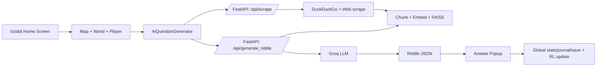
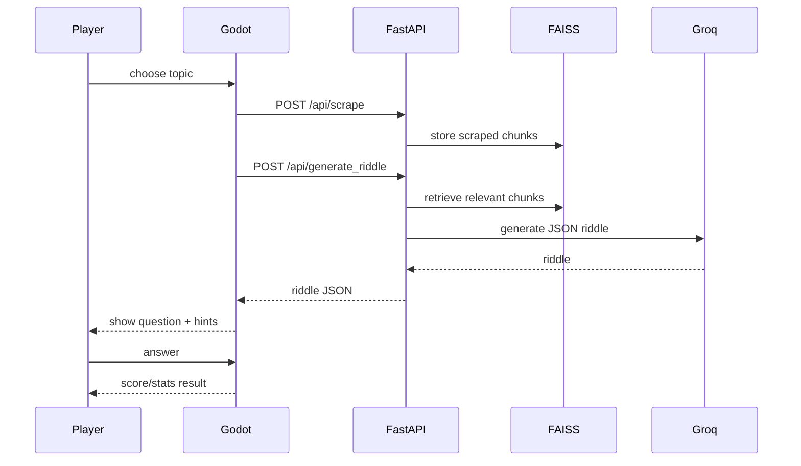

# Endless Worlds — Short Interview Prep Guide

A very simple guide to explain this project in interviews.

## 30-second elevator pitch
Endless Worlds is a 2D Godot game for learning. The player explores a generated island, gets AI-based questions, collects hints, and answers at wells. A Python FastAPI server scrapes web content, stores context in a vector index, and asks a Groq LLM to generate questions.

## 2-minute explanation
- Frontend: Godot 4 game (player, world, UI, question flows).
- Backend: FastAPI server for scraping + retrieval + LLM generation.
- AI: RL model adjusts difficulty based on wins/losses and hint usage.
- Learning loop: topic -> scrape -> generate riddle -> collect hints -> answer -> score/stats/journal update.
- Coding mode: player solves coding tasks and gets AI evaluation feedback.

## 5-minute explanation (simple structure)
1. Player picks a topic on home screen.
2. Game loads map scene, generates world, spawns player and interactables.
3. `AiQuestionGenerator` calls backend `/api/scrape` then `/api/generate_riddle`.
4. Backend scrapes web pages, chunks text, embeds with MiniLM, stores in FAISS, retrieves top chunks, asks Groq for strict JSON riddle.
5. Player collects hint pickups, opens well popup (MCQ/Wordle/KBC/etc.), submits answer.
6. `Global` updates score, stats, journal, save file, and RL feedback.
7. Player returns to home screen with updated progress.

---

## System architecture

## Flow diagram

---

## Folder structure (what each part does)
- `/core`: global state, env loader, ambience manager.
- `/map_components`: world generation, weather, time, wells, hint spawns.
- `/player`: movement, animation, camera shake.
- `/ai`: question generation client, RL difficulty, bot assistant.
- `/ui`: home, answer popups, journal, tutorial, stats, keyboard.
- `/python_server`: FastAPI, scraping, vector DB, LLM calls.
- `/data`: coding questions JSON.
- `/web-scraper-tool`: older Node scraper prototype.

## Module map (purpose, why, internals, links)
- `core/global.gd`: single source of game truth (score/stats/save/RL). Needed to share state across scenes.
- `map_components/map.gd`: game orchestrator. Connects world, player, UI, AI question flow.
- `ai/ai_question_generator.gd`: handles backend calls + loading UI + fallback riddles.
- `ui/answerpopups/answer_popup.gd`: all question game modes and answer validation.
- `python_server/main.py`: API routes and orchestration.
- `python_server/services/scraper.py`: search + scrape + clean page text.
- `python_server/services/vectordb.py`: chunk/embeddings/FAISS retrieval.
- `python_server/services/llm.py`: prompt building + JSON riddle generation + code evaluation.

## Important code (line-by-line style, short)
- `core/global.gd`
  - `_ready()` loads save and RL.
  - `save_game()` writes `user://save.json`.
  - `end_game(win)` updates all lifetime stats + RL feedback.
- `ai/ai_question_generator.gd`
  - `generate_riddle()` starts scrape then generation.
  - `_on_scrape_response()` logs scrape result, then asks riddle API.
  - `_on_server_response()` stores data and emits `riddle_generated`.
- `python_server/main.py`
  - `/api/scrape`: reset FAISS -> scrape -> chunk -> store.
  - `/api/generate_riddle`: retrieve docs -> generate JSON riddle.
  - `/api/evaluate_code`: evaluate coding answer with LLM.

---

## Dependencies (why used)
- Godot 4: game engine and scene system.
- FastAPI + Uvicorn: fast backend API server.
- requests + bs4 + lxml + ddgs: web search/scrape/HTML parsing.
- sentence-transformers + faiss-cpu + numpy: embeddings and vector retrieval.
- groq + httpx: LLM inference.
- python-dotenv: environment variables.
- Node tool (`express`, `axios`, `cheerio`) exists as legacy prototype.

## Alternatives (and why current choice)
- Unity/Unreal instead of Godot: stronger ecosystem, but heavier and slower for this scope.
- Flask instead of FastAPI: simpler, but FastAPI gives better typing and docs.
- Pinecone/Weaviate instead of FAISS: cloud scaling, but FAISS is free/local/simple.
- OpenAI/Claude instead of Groq: strong models, but Groq can be fast/cost-effective.

## Advantages
- Clear modular game architecture.
- Dynamic topic-based content.
- Adaptive RL difficulty.
- Offline-safe fallback riddles.

## Disadvantages
- Heavy answer popup script (high complexity).
- No real auth/user isolation.
- Many runtime network dependencies.
- In-memory vector index (not persistent DB).

## Complexity (quick)
- World generation: O(W×H).
- Hint spawn attempts: up to O(k * attempts), bounded.
- Vector retrieval: embedding O(n) build, FAISS query ~O(n) for flat index.
- Save/load stats: O(1) to O(n) with journal size.

## Common bugs + debugging
- Backend not running -> fallback riddles only.
- Missing `GROQ_API_KEY` -> generation fails.
- Empty/invalid JSON from LLM -> parse errors.
- UI mode mismatch in answer popup -> wrong handler path.
- Use logs in Godot + FastAPI route logs first.

## Security notes
- Keep API keys only in `.env`, never in code.
- Validate and sanitize external text before prompts.
- Add request throttling/rate limits.
- Avoid disabling SSL verify in production.

## Performance ideas
- Cache scrape results by topic.
- Batch embeddings and reuse vectors.
- Split large popup script into smaller components.
- Add timeout/retry strategy for network calls.

## Scalability ideas
- Move from in-memory FAISS to persistent/vector service.
- Add queue workers for scraping and generation.
- Add per-user state store (Redis/Postgres).
- Add API auth and tenant isolation.

## Real-world use cases
- AI tutoring game.
- Topic revision for students.
- Coding practice with game mechanics.
- Adaptive learning platform prototype.

---

## API summary
- `POST /api/scrape` -> scrape + chunk + embed + store.
- `POST /api/rag` -> prompt + retrieved context reply.
- `POST /api/generate_riddle` -> riddle/options/solution/hints JSON.
- `POST /api/evaluate_code` -> `{passed, feedback}`.

## Authentication flow
- No auth implemented right now.

## Database schema
- No SQL DB.
- Local game save: `user://save.json` (stats, topic, journal).
- RL model save: `user://difficulty_rl.json`.
- Backend knowledge store: in-memory FAISS + chunk list.

## Data flow (frontend -> backend -> model -> frontend)
1. Topic from home screen.
2. Godot calls scrape API.
3. Backend scrapes web + stores vectors.
4. Godot calls generate API.
5. Backend retrieves docs + asks LLM.
6. Godot renders question and evaluates answer in gameplay.

## Deployment process (simple)
- Game: export from Godot to desktop/web.
- Backend: run `python_server/start_server.sh` (or uvicorn main).
- Env: set `GROQ_API_KEY` in `.env`.

## Testing strategy
- Manual gameplay tests for each question mode.
- API smoke tests for all endpoints.
- Edge-case tests: empty topic, network fail, invalid JSON, no vectors.

## Challenges + how solved
- Dynamic content reliability -> fallback riddles + robust logging.
- Difficulty balancing -> RL feedback from game outcomes.
- UI complexity -> mode-based popup handlers.

## Current limitations
- No authentication.
- Some SSL checks are disabled in backend.
- Big single-file UI logic for answer popup.

## Future enhancements
- Persistent user accounts.
- Safer networking and strict SSL in production.
- Split popup logic into smaller reusable modules.
- Better automated tests and CI checks.

---

## Interview answer format (use for every question)
- **What interviewer checks:** your reasoning + tradeoffs.
- **Ideal answer:** clear architecture + one practical example.
- **Common mistake:** only listing tools, no “why”.
- **Follow-up ready:** mention one limitation + one improvement.
- **30-sec version:** 2-3 lines.
- **2–5 min version:** flow + design choices + tradeoffs.

---

## Beginner (10)
1. What is this project? — A learning game with AI-generated questions.
2. Main tech stack? — Godot + FastAPI + FAISS + Groq.
3. Where is game state kept? — `core/global.gd`.
4. How is world made? — Noise-based tile generation.
5. How are questions made? — Scrape + retrieve + LLM JSON output.
6. What is RL used for? — Auto difficulty tuning.
7. Where are coding tasks? — `data/coding_questions.json`.
8. Where are APIs? — `python_server/main.py`.
9. How is progress saved? — Local JSON files.
10. How does player lose? — Hearts reach zero.

## Intermediate (10)
1. Why autoload `Global`? — Shared state across scenes.
2. Why FAISS? — Fast local vector search.
3. Why fallback riddles? — Keep game playable on failure.
4. How does hint flow work? — Spawn pickups -> unlock bulbs -> tooltip hints.
5. How does KBC mode differ? — Lock-in + lifelines + suspense flow.
6. Main backend bottleneck? — Scrape + LLM latency.
7. Key coupling risk? — Large `answer_popup.gd`.
8. How would you reduce errors? — Stronger schema validation + retries.
9. Where is difficulty updated? — `Global.end_game()` / `DifficultyRL.give_feedback()`.
10. Why chunk text? — Better retrieval quality and token control.

## Advanced (10)
1. Biggest architecture risk? — Tight UI logic concentration.
2. Production risk in backend? — Disabled SSL verification.
3. RAG quality limitation? — Flat retrieval, no reranking.
4. Scaling limit now? — In-memory vector store per process.
5. State consistency issue? — Multi-scene updates without strict contracts.
6. Better RL approach? — Contextual bandits or policy optimization.
7. Stronger observability? — Structured tracing across Godot/API.
8. Better prompting? — JSON schema enforcement + guardrails.
9. Better fault tolerance? — Topic cache + queued generation jobs.
10. Better domain model? — Split question modes into strategy classes.

## Follow-up questions (10)
1. What tradeoff did you make first?
2. What would you refactor first?
3. How would this behave with 10k users?
4. What would you cache and why?
5. Where can data corruption happen?
6. How do you debug wrong answers being marked correct?
7. How do you test network failure paths?
8. What metrics matter most?
9. How would you secure this for production?
10. What would you build in version 2?

## Scenario-based (5)
1. LLM is down. What happens? — Use fallback riddles and show warning.
2. Scraper returns junk text. Fix? — Better cleaning + source filters.
3. Player says difficulty is unfair. Fix? — Tune rewards and thresholds.
4. API is slow. Fix? — Cache topic results + async job queue.
5. Wrong answer judged as correct. Fix? — Normalize casing/whitespace and add tests.

## “Why X over Y?” (5)
1. Godot vs Unity? — Faster setup and lighter for this scope.
2. FastAPI vs Flask? — Better typing/docs by default.
3. FAISS vs cloud vector DB? — Cheaper and simple locally.
4. Groq vs other LLM APIs? — Performance/cost fit for this project.
5. JSON save vs SQL DB? — Simpler for single-player local state.

## Debugging (10)
1. Why no riddle appears?
2. Why hints are not spawning?
3. Why heart UI desyncs from damage?
4. Why map loads but player can’t move?
5. Why coding mode request fails?
6. Why RL difficulty never changes?
7. Why journal stays empty?
8. Why KBC lock button doesn’t respond?
9. Why scrape endpoint returns 500?
10. Why generated JSON parse fails?

## Optimization (5)
1. How to cut riddle latency?
2. How to reduce UI frame drops?
3. How to reduce repeated scraping cost?
4. How to optimize world generation time?
5. How to reduce memory in popup systems?

## System design (10)
1. Design multi-user profile support.
2. Design persistent leaderboard.
3. Design scalable question-generation pipeline.
4. Design topic-result caching service.
5. Design retry and dead-letter handling for failed generation.
6. Design secure API key and secret management.
7. Design analytics for learning outcomes.
8. Design CI/CD for game + backend.
9. Design anti-abuse/rate-limiting for APIs.
10. Design offline-first gameplay with delayed sync.

---

## Quick prep tips
- Memorize the flow: **Topic -> Scrape -> RAG -> Riddle -> Answer -> Stats**.
- Always explain **why this design** and **what you would improve**.
- Keep answers simple: problem, approach, tradeoff, next step.
